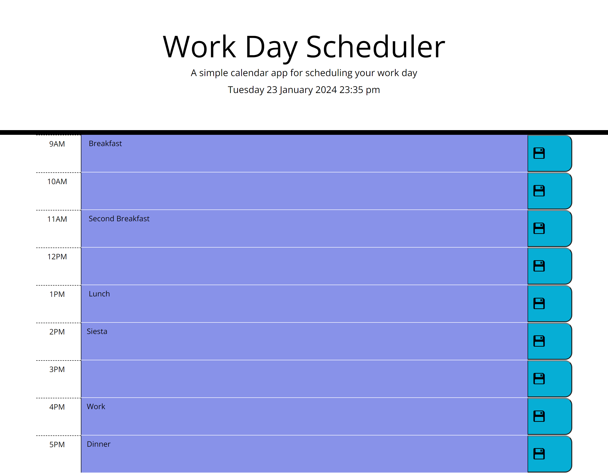

# Work-Day-Planner
Simple day-to-day planner to add events for each hour of the day.

## **User Story**

I want a single day planner that splits the day up into hours (9am to 5pm)

## **Site Link**

Visit my Work-Day-Planner page here: https://brooksy236.github.io/Work-Day-Planner/ 

## **Screenshots**

## **Installation**

_N/A_

## **Usage**

Click on a block to enter a task for that hour and click the save button to store it in local storage.

## **License**

MIT License
